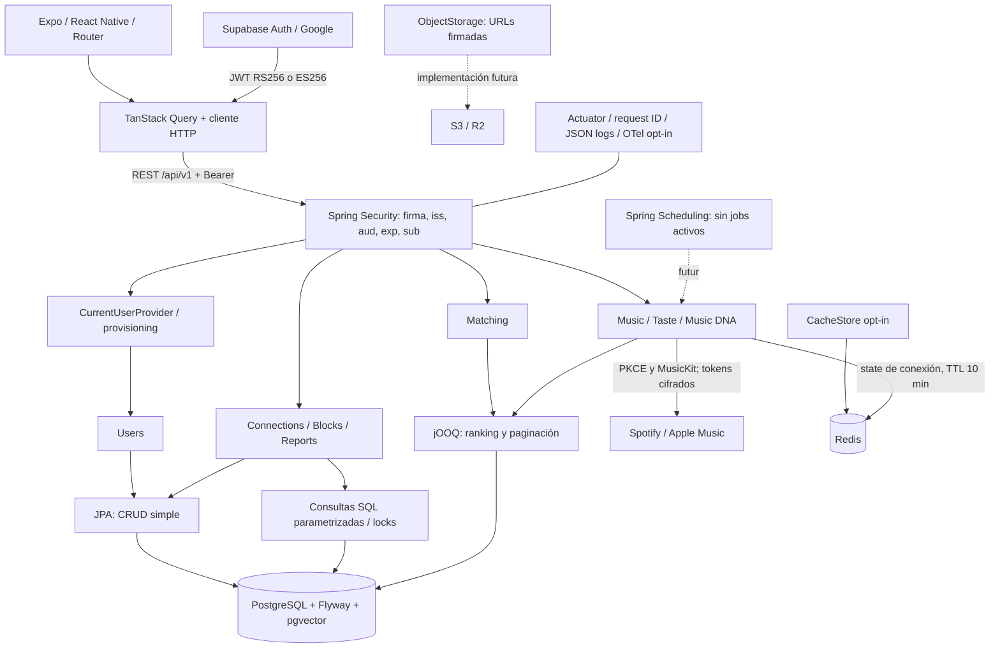

# Arquitectura

Wavelength es un monolito modular, desplegado como una aplicación Spring Boot.
La unidad de organización es el dominio: auth, users, music, matching, social,
concerts y activity. No hay módulos Gradle artificiales ni interfaces para cada
servicio. Los paquetes comunes contienen únicamente infraestructura compartida.

## Decisiones

- Java 21 LTS, Spring Boot 3.5, Gradle wrapper 8.14.3.
- Expo SDK 55 con versiones nativas alineadas mediante `expo install --fix`.
- JPA gestiona usuarios, cuentas musicales y conexiones. No se devuelven entidades.
  Las relaciones usan UUID explícitos, evitando cargas lazy y N+1 accidentales.
- jOOQ ejecuta SQL parametrizado para ranking y afinidades. La generación de clases
  desde una BD queda diferida: exigir una BD durante cada build no aporta valor
  aún. Los tests con migraciones reales verifican nombres y tipos del SQL.
- DTO privado de `/me` separado del perfil público mínimo. El `externalAuthId` no
  se expone. Discoverable es false para altas nuevas: participación voluntaria.
- Un único issuer activo. Migrar de proveedor requiere mapear subjects existentes;
  soportar varios issuers simultáneos requeriría identidad `(issuer, sub)`.
- No hay usuario/contraseña, bypass de JWT ni JWT de demo aceptado por backend.
- El PATCH conserva campos omitidos y borra opcionales con null. Su documento JSON
  se valida con allowlist, tipos estrictos y Bean Validation antes de escribir.
- Los bloqueos son direccionales al guardarse y bidireccionales al restringir acceso.
  Bloquear rechaza conexiones previas; desbloquear no las restaura.
- Solicitudes únicas por pareja para toda su vida útil, también tras rechazo.
  Reintentos tras rechazo se difieren para evitar spam y reglas de cooldown prematuras.
- La bandeja de conexiones aplica la misma visibilidad que el perfil público:
  solo incluye a la otra persona si es discoverable o la conexión está aceptada.
  Excluye bloqueos y perfiles ocultos antes de paginar.
- Las mutaciones de conexiones y bloqueos toman locks de ambas filas de usuario en
  orden de UUID de PostgreSQL. Evitan carreras y deadlocks por orden inverso.
- La identidad de un artista importado de Spotify se basa en su ID de Spotify.
  Coincidir solo en el nombre no justifica unir dos artistas canónicos; una
  reconciliación entre proveedores requerirá evidencia adicional.

## Matching explicable

Peso por artista = media de short/medium/long term. Similitud =
`sum(min(A_i, B_i)) / sum(max(A_i, B_i))` para la unión de artistas.
Sin señales o con unión cero: 0; idénticos: 1; sin artistas comunes: 0.
Los scores deben ser finitos y estar entre 0 y 1. Es simétrico y determinista.

Solo se usa la señal de artistas: equivale a renormalizar su peso disponible al
100%. Track, neighborhood, recent y discovery están reservados en el modelo,
pero no se rellenan con ceros que penalicen artificialmente el resultado.
El porcentaje representa solapamiento musical, no probabilidad de amistad.

El ranking SQL calcula todos los candidatos discoverable con solapamiento, excluye
al solicitante y bloqueos de ambos sentidos, ordena por score descendente y UUID
ascendente, después aplica LIMIT. Cada resultado incluye el número de artistas
con peso positivo compartidos. No hay N+1 ni truncado arbitrario de candidatos.
Cursor: score + UUID, base64url validado. Cambios concurrentes de gustos pueden
modificar el ranking entre páginas; no es una instantánea persistida.
La tabla matches queda lista para futuras recalculaciones, pero hoy no se usa como
cache para evitar resultados obsoletos tras un bloqueo.

## Mobile

Router controla navegación y guardas de sesión. TanStack Query contiene server
state; formularios usan estado local. HTTP central añade JWT, timeout y errores
normalizados. SecureStore nativo, memoria en web, ninguna credencial en AsyncStorage
o localStorage. Cerrar sesión cancela y limpia queries. Un 401 renueva el access token
y reintenta una vez; si sigue fallando, elimina la sesión.

La demo contiene fixtures aislados, banner visible y ninguna mutación al backend.
Supabase Auth gestiona Google OAuth, persistencia y renovación; el backend solo
valida firma y claims del access token. Cerrar sesión usa el alcance local de
Supabase; los access tokens
emitidos pueden seguir siendo válidos hasta expirar. Véase [identidad](auth.md).

## Límites conscientes

- Conexiones musicales y cifrado AES-GCM implementados, pero sin KMS administrado.
  Spotify importa artistas, fotos y canciones destacadas tras la autorización y
  sincronización; Apple Music aún no importa gustos. Véase [proveedores](music-providers.md).
- Sin uploads S3/R2: interfaz; no bean que finja almacenar archivos.
- Sin workers activos, colas, chat, feed, push, pagos, ML ni embeddings.
- pgvector y tabla sin dimensión fija; definir modelo/versionado antes de índices.
- RateLimitPolicy documenta el punto de integración; no limita tráfico todavía.
  Un despliegue público requiere rate limiting en gateway o filtro Redis.
- Matching on-demand escanea afinidades. Medir con EXPLAIN y métricas antes de
  materializar scores; no prometer escala ilimitada con este primer algoritmo.
- Servicios de moderación operativa, borrado/exportación de cuentas y retención
  de reports deben definirse antes de abrir el producto al público.

## Observabilidad y despliegue

Logs JSON y request ID validado (sin bodies, tokens, SQL bind values ni datos de perfil).
Actuator expone solo health sin detalles. Liveness `/api/v1/health` no consulta DB;
`/actuator/health` incluye dependencias para readiness del Compose.
Micrometer + bridge OTel + exportador OTLP instalados, tracing desactivado por defecto.
Para conectar: `TRACING_ENABLED=true`, configurar
`MANAGEMENT_OTLP_TRACING_ENDPOINT` y sampling por entorno.
Sentry: futuro adaptador en la frontera de errores backend y root mobile con scrub
de cabeceras/perfiles. PostHog: eventos consentidos en acciones de producto, nunca
tokens ni nacimiento. No SDKs/credenciales ni llamadas de analytics activos.

La imagen no tiene estado y corre como usuario sin privilegios. Railway, Render y
AWS pueden inyectar JDBC URL, Redis, issuer/JWKS/audience y PORT. Producción no debe
activar `dev`; habilitar TLS y gestionar secretos fuera de Git. Migraciones
Flyway requieren permisos para pgvector; en servicios administrados un operador
puede preinstalar la extensión. No reutilizar el Compose de desarrollo en producción.
